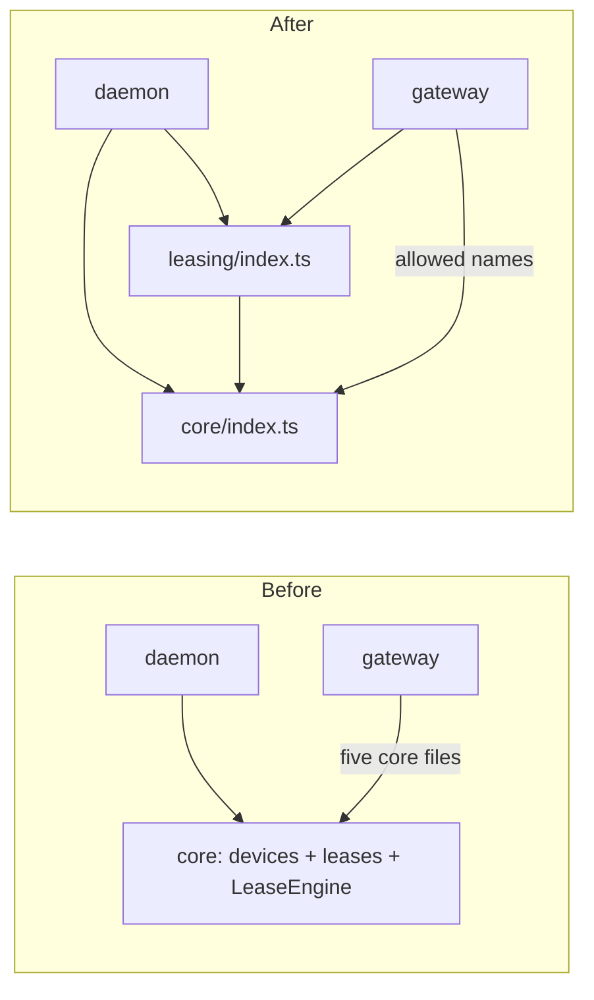

# 0018. Leasing is one module, and every module is entered through its index

- **Status:** Proposed
- **Date:** 2026-10-05
- **Issue:** [#358](https://github.com/callstackincubator/simlock/issues/358)
- **Supersedes:** nothing. Narrows [ADR 0005](0005-gateway-and-worker-modes.md)
  §33: the gateway's allowed imports from `core` become named imports
  from two module indexes instead of a list of core files.
- **Depends on:** [ADR 0006](0006-events-and-log-are-two-records.md) for
  the event bus every lease fact goes out on, and [ADR
  0017](0017-the-warm-pool-is-a-module-beside-the-lease-transaction.md) for the warm-pool module
  and architecture rules 14 and 15. Amends rule 14 (§3) and replaces the
  composition root ADR 0017 names, `LeaseEngine` (§2).

## Context

Leasing has no home. The request book, the wait queue, the planner, the
acquisition, lifecycle, expiry and release coordinators, and the health
monitor are files in `src/core/`, next to the registry, the provisioner,
the warm pool, cleanup and the drivers' interface. `LeaseEngine` builds all
of them at once, so nothing marks where leasing ends and device management
begins.

Other modules reach into those files directly. The daemon imports
`core/lease-ports.js`. The gateway imports `core/wait-queue.js`,
`core/lease-request-book.js` and three more core files, by an allow-list in
`src/gateway/boundary.test.ts`. HTTP's test fakes import core internals.
Each of those imports pins a file name another module may not rename.

Import rules live in four vitest boundary tests (core, gateway, contract,
client), each a hand-written list. None of them says "only through the
index", and none covers a module that does not have a test.

## Decision

### 1. `src/leasing/` owns every lease rule

A new module, `src/leasing/`, holds: the lease request book, the wait
queue, the acquisition planner and coordinator, the lease lifecycle, the
expiry scheduler, the release coordinator, the leased-device health
monitor, and the startup reconciler of
[ADR 0019](0019-startup-ends-every-lease-whose-device-is-not-running.md).

`src/core/` keeps device management: the registry and its persistence,
capacity, the provisioner, the managed device lifecycle, the warm pool,
cleanup and the reaper, quarantine, nuke, doctor, the driver interface and
catalog, and the device half of startup convergence. Lease records stay in
the registry, because a grant and the device's move to `leased` are one
`state.json` write.

### 2. Core never imports leasing

Where device management must act on a lease, core declares the interface
it needs and leasing implements it. Nuke already works this way: it calls
`releaseAllDuringMaintenance` through an interface declared in core. The
daemon wires the two together.

`LeaseEngine` goes away. `createCore(...)` builds core's services,
including ADR 0017's warm-pool module, `createLeasing({ core, ... })`
builds leasing's on top of them, and the daemon's `main.ts` calls both.
The health monitor stays optional in rule 15's sense: leasing's required
parts never import it, and `createLeasing` wires it or leaves it out. The gateway stays a sibling: it imports
leasing's index for the request book, the queue and their errors, and
core's index for the shapes they are typed against.

### 3. Every module is entered through its `index.ts`

A file outside `src/leasing/`, `src/core/` or `src/gateway/` imports from
that module only `<module>/index.js`. The index lists the module's public
surface; every other file in it is private and may be renamed or split
without touching another module.

A module may also have a `testing.ts`: fakes and test wiring other modules'
tests use, such as `FakeDriver` and today's `core/test-wiring.ts`. Only a
test file may import it: a `*.test.ts` file, or a test helper named
`test-*.ts`, such as `src/http/test-fakes.ts`, that only tests import.
Production code that needs a fake is a bug. Anything production code
also uses, such as the in-memory lease request store the gateway runs
on, belongs on the index, not in `testing.ts`.

This amends architecture rule 14, which lets only a directory's own tests
import a file inside it. Rule 14 gains two sentences: another component's
tests may import its `testing.ts`, and `pnpm lint` enforces the rule.

### 4. One lint config holds every rule about a file's own imports

`pnpm lint` enforces them through oxlint's
`no-restricted-imports`, configured in `.oxlintrc.json`:

- **Index only:** outside a module, any path into `leasing/`, `core/` or
  `gateway/` other than `index.js` fails. The same holds one level down,
  for every component directory rule 14 covers that has an index:
  `core/capacity/`, `core/warm-pool/`, `drivers/ios/`, `drivers/android/`,
  and any directory leasing grows. A file inside the directory imports
  its siblings freely. In a `*.test.ts` file or a `test-*.ts` helper, `testing.js` is allowed
  too. The two directories rule 14 names as predating it,
  `core/cleanup/` and `gateway/routing/`, get their pattern in the change
  that gives them an index.
- **Direction:** a per-directory override says what each module's
  production files may import. Test files are exempt from direction
  rules, as today: a core test may read real files with `fs`, and may
  build real leasing through `leasing/testing.js`. They still enter
  every module through its index or `testing.js`.
  `src/core/**` may not import `leasing/`, a driver, `fs` or
  `child_process` (core reaches the filesystem and processes through
  injected ports). `src/leasing/**` may not import a driver, `fs` or
  `child_process`, for the same reason. `src/daemon/**` other than
  `main.ts` may not import `gateway/`: the composition root is the only
  daemon file that knows a gateway exists. `src/gateway/**` may not import `drivers/`, `http/`,
  `cli/` or `mcp/`, from `daemon/` only `dispatch.js`, and from core's index only the names its allow-list
  gives (`allowImportNames`). `src/contract/**` imports nothing outside
  itself.

Lint checks one file's own imports. Two checks follow imports further and
stay as tests: `src/simlock-client/no-core-leak.test.ts`, which compiles the
public package and reads the emitted declarations, and the gateway test
that `daemon/dispatch.js` reaches no core module. Every other check in
`src/core/boundary.test.ts`, `src/gateway/boundary.test.ts` and
`src/contract/boundary.test.ts` moves to lint, including the gateway file's
check that daemon files do not import the gateway, and the test is deleted
with it. Each rule that moves is proven by a lint fixture that fails
without it.

### 5. Events stay observer-only

Leasing emits the same `lease.*` events, after the registry commit that
made them true. No module drives a lease through an event: the daemon,
the gateway and core call leasing's functions directly, and the reaper,
the event history and owner-routed pushes only observe.

## Consequences

- Every deep import that exists today is rewritten: the daemon's
  `core/lease-ports.js`, the gateway's queue and coordinator, HTTP's test
  fakes, and the drivers' `core/driver.js`. Driver types are already on
  core's index.
- `LeaseReleaseReason` is defined twice today (`lease-ports.ts` and
  `lease-release-coordinator.ts`); the move leaves one, in leasing.
- A new module gets the index rule by adding one pattern to
  `.oxlintrc.json`.
- oxlint overrides replace a rule's options rather than merging them, so
  each override repeats the index-only patterns it still needs. The
  config is longer than a single rule, and a reviewer reads it as one
  table.
- The move is mechanical but wide: most of `src/core/lease-*`, its tests,
  and `main.ts`'s wiring change in one series of PRs. Behaviour does not
  change except where ADR 0019 says so.

## Alternatives considered

- **Keep leasing in core, with a barrel per folder.** Rejected: the rule
  "core never imports leasing" has no folder to point at, so nothing stops
  the two from growing back together.
- **Keep the vitest boundary tests and add lint only for index imports.**
  Rejected: import rules would live in two mechanisms, and a reader would
  have to check both to know whether an import is allowed.
- **Let tests import internals freely.** Rejected: a refactor inside a
  module would still break other modules' tests, which is the coupling
  this ADR removes.
- **Put fakes on the public index.** Rejected: production code could
  import a fake driver without anything failing.
- **Drive lease side effects through events.** Rejected: a grant, a
  release and a reclaim must happen in order or not at all, and an event
  bus gives no order and no failure back to the caller.
