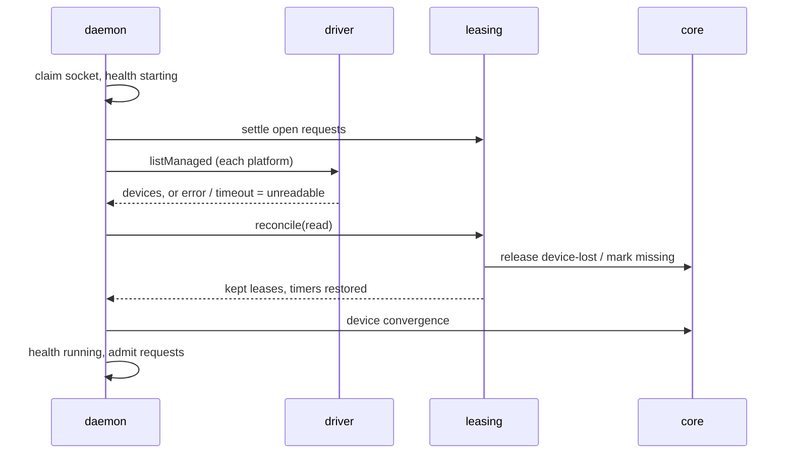
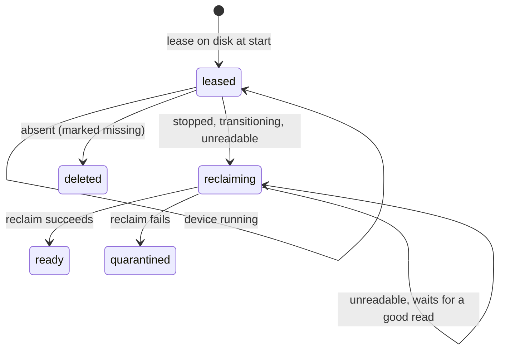

# 0019. Startup ends every lease whose device is not running

- **Status:** Proposed
- **Date:** 2026-10-05
- **Issue:** [#358](https://github.com/callstackincubator/simlock/issues/358)
- **Supersedes:** nothing. Narrows [ADR
  0004](0004-ttl-first-leases-on-every-transport.md): its consequence
  "Startup restores every lease's TTL timer from its persisted deadline",
  and the "nothing is swept" reading of it, now hold only for a lease
  whose device is running. Narrows [ADR
  0003](0003-one-typed-daemon-contract-behind-every-frontend.md)'s
  `status.get`: four fields become optional. Narrows [ADR
  0005](0005-gateway-and-worker-modes.md) §20's worker view: its device,
  lease, capacity, queue and catalog fields become optional too.
- **Depends on:** [ADR
  0018](0018-leasing-is-one-module-and-every-module-is-entered-through-its-index.md)
  for the leasing module that owns the reconciler, and [ADR
  0017](0017-the-warm-pool-is-a-module-beside-the-lease-transaction.md) for the
  device convergence that runs after it.

## Context

Leases are durable. Each grant, renew and release is one atomic write of
`state.json`, so a lease survives a crash, a `daemon stop` or a Mac
reboot. ADR 0004 keeps it on purpose: a restart does not prove its holder
is dead, and a holder that renews from a new connection keeps its device.

A restart does say something about the device, though, and nothing reads
it. After a reboot a leased simulator is shut down, still booting, or
gone. The lease is kept, and the leased-device health monitor handles it
only after startup: it reboots a stopped device, and gives up on a missing
one only after `health.stableObservations` rounds. Meanwhile the device's
slot is taken by something nobody can use.

Startup already has a gate. The daemon claims its socket, sets health to
`starting`, and parks every request except `hello` and `status.get` until
convergence finishes. But `status.get` answers from the unchecked
registry, so `simlock status`, the console and a gateway's worker link all
read leases and devices nobody has looked at. A gateway's lease index
records them.

Separately, a request granted just before a crash is settled as failed at
the next start, because its result is written one step after the lease
(KNOWN-PITFALLS, "A restart between a grant and its record write").

## Decision

### 1. Startup reads each platform once, then checks every lease

Startup runs in this order, all while health is `starting`:

1. Settle every lease request still open, as today.
2. Read each platform's devices once: one `listManaged` per driver, the
   read doctor's startup pass already makes. Doctor and the reconciler
   share it; nothing polls twice. Each platform's read has a fixed limit
   of 60 seconds. A platform with no driver, or whose listing throws or
   passes the limit, is *unreadable*. An unreadable platform no longer
   fails startup. Android's `adb devices` gets a command timeout of its
   own, 30 seconds, below the startup limit.
3. Leasing's reconciler checks every lease against that read (§2).
4. Kept leases get their expiry timers back, from their persisted
   deadlines.
5. Core's device convergence runs as ADR 0017 leaves it: quarantine
   timers, interrupted reclaims, spent devices. It skips every device on
   an unreadable platform, as it already skips a platform with no driver,
   so a reclaim §2 leaves waiting is not started here either.
6. Health becomes `running`; parked requests proceed and the health
   monitor starts.

Steps 2 to 5 run one after another. Today doctor and device convergence
run side by side; the reconciler needs doctor's read before it can start,
and device convergence must not pick a device the reconciler is about to
release.

### 2. What happens to each lease

A lease whose deadline passed while no daemon ran expires through the
ordinary expiry path, as today. Every other lease is judged by what the
read says of its device:

| Device in the read | Lease | Device |
|---|---|---|
| running | kept | unchanged |
| stopped | ended | wiped by the ordinary reclaim and returned to the pool |
| transitioning (booting or shutting down) | ended | as stopped |
| absent from a readable platform | ended | marked missing in the same write |
| on an unreadable platform | ended | `reclaiming`, with no reclaim started |

"Ended" is the ordinary release with reason `device-lost`, the reason the
health monitor already uses, emitting `lease.released` post-commit. No
release reason and no event is added. Android reports `transitioning` also for an emulator it cannot tell apart
from another serial this read, because `adb shell getprop` failed. Such a
lease is ended like any other `transitioning` one. The maintainer accepted
that cost: a daemon restart during an adb hiccup can end a lease on an
emulator that is in use.

A device absent from its platform
has nothing to wipe: one registry write removes the lease and marks the
device missing through doctor's missing-device fix (`device.deleted`,
initiator `doctor`), and no reclaim starts for it.

A device on an unreadable platform moves to `reclaiming`, but no reclaim
starts for it, whether the platform has no driver or its listing failed.
A driver that just failed or hung on a listing would likely hang the
reclaim too, and a hung reclaim holds its device's claim with no end. The
device waits, unclaimed, until a start whose read of that platform
succeeds recovers it as an interrupted reclaim. Meanwhile `status` reports
it stalled once it passes the stalled-transition threshold, and
`simlock doctor --fix` quarantines it, as for any stalled reclaim.

### 3. `status.get` answers only what is checked

While health is `starting`, `status.get` returns `daemon` (health, mode,
console address) and `host`, and nothing else. `devices`, `leases`,
`capacity`, `queueDepth`, `installs`, `waiting` and `workers` are absent,
not empty: empty would claim the daemon holds nothing. `devices`,
`leases`, `capacity` and `queueDepth` become optional in the contract, so
the wire protocol rises by one from whatever version is current when this
lands; a peer on the previous version would fail to parse a starting
answer. HTTP's `GET /v1/status` follows the
operation. The CLI prints one line instead of the missing blocks, and the
console shows the daemon as starting.

A gateway builds a worker's view from `status.get`. While the worker is
`starting`, the view carries its health and host only: its `devices`,
`leases`, `capacity`, `queueDepth`, `installs`, `waiting` and `catalog`
are absent, so they become optional in the worker view schema too. The
fleet lease index takes nothing from a starting worker. Routing already skips a worker that is not
`running`.

### 4. A grant and its request's result are one write

`Registry.createLease` takes the id of the request the lease serves, and
the same `state.json` write that commits the lease marks that request
granted with the lease's id. A crash can no longer separate them, and the
first step of §1 never sees that request as open. A repeat of the request
under the same key answers with the lease.

The one write stores the whole grant a repeat answers today: device,
environment, lease and timing. The acquisition path builds the
environment and timing before the write rather than after it.

A repeat answers the grant as recorded even when §2 has since ended that
lease, as any repeat of a settled request does today after a release or
an expiry. The holder's first renew answers `UNKNOWN_LEASE`, and it exits
as for any `device-lost`.

## Consequences

- An agent whose simulator was still booting at startup loses its lease,
  and the device is wiped. A Mac reboot makes that likely. This is the
  chosen trade: a lease nobody can use for minutes costs every other
  agent a slot.
- A driver failure at startup, or a listing slower than 60 seconds, ends
  every lease on that platform. Before this ADR a failure failed startup
  instead, and a hung `adb devices` kept the daemon starting forever.
- Startup is slower by the slowest platform listing before convergence,
  up to the 60-second limit, and by running doctor and device convergence
  one after the other.
- The health monitor's runtime behaviour is unchanged: a device that stops
  after startup is still rebooted, and a missing one is still debounced.
- Startup waits up to 60 seconds per platform for its read, read side by
  side.
- `StartupConverger` loses its lease work (settling requests, restoring
  timers) to leasing; its docblock, which still names a removed
  `#releaseOrphanedHeldLeases`, is rewritten.
- `docs/HTTP-API.md`, `docs/CLI.md`, `docs/CONSOLE.md`, both
  `EVENTS.md` files (a new source for `lease.released` with `device-lost`)
  and `docs/internal/ARCHITECTURE.md`'s startup section change with the
  code. KNOWN-PITFALLS loses the grant-then-restart entry.

## Alternatives considered

- **Keep every lease, as ADR 0004 reads today.** Rejected: the health
  monitor fixes it eventually, but a missing device holds a slot for
  several rounds and a stopped one is rebooted for a holder that may be
  gone.
- **Reboot a stopped leased device at startup instead of ending the
  lease.** Rejected: it spends boot time on devices whose holders may
  never return, and keeps the device out of the pool while it boots.
- **Keep leases on an unreadable platform.** Rejected by the maintainer:
  a lease on a device nobody can check is the same unknown as a missing
  device, and keeping it pins a slot for its full TTL.
- **A new release reason, `restart`.** Rejected: holders already treat
  `device-lost` as "your device is gone", which is what they need to know.
- **Keep `status.get` answering in full while starting, with a flag.**
  Rejected: every reader would have to remember to check the flag, and
  the gateway's lease index already shows one that did not.
- **Settle a granted request from its lease at startup**, instead of
  writing both at once. Rejected: it guesses which lease a request got;
  one write makes the answer a fact.
