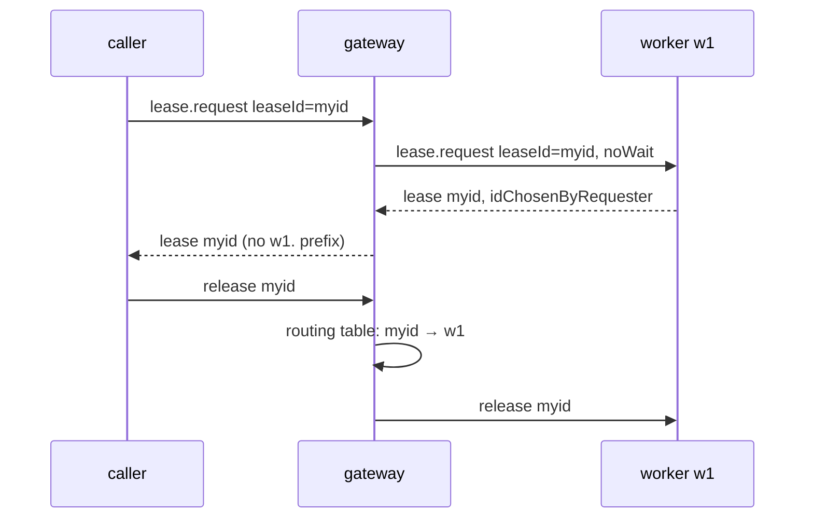

# 0020. A requester may choose its lease id, and the gateway passes it through bare

- **Status:** Proposed
- **Date:** 2026-10-06
- **Issue:** [#410](https://github.com/callstackincubator/simlock/issues/410)
- **Supersedes:** nothing. Narrows [ADR 0005](0005-gateway-and-worker-modes.md)
  §16 ("a gateway lease id names its worker") and decision 5 ("the lease id
  the only routing key"): both now hold only for a lease whose id simlock
  generated.

## Context

agent-device runs its own leasing engine and leases devices through simlock.
Each side names the lease with its own id, so agent-device has to store a
mapping between the two. This is temporary: agent-device will later move to
simlock leases. Until then, the cheapest link is for simlock to use
agent-device's id as its own.

On one host that is a small change: the registry uses the id it was given
instead of minting `lse_<uuid>`. Through a gateway it is not. ADR 0005 §16
names a gateway lease `<workerId>.<workerLeaseId>`, so the gateway routes
renew, release and reads by splitting the id, with no state of its own. A
caller that sent `myid` would get back `w1.myid`, and the mapping would be
back.

## Decision

### 1. A requester may send a lease id

`lease.request` takes an optional `leaseId`. When present, the granted lease
has exactly that id; when absent, simlock generates one as before. The id is
ASCII, 1–64 characters, starts with a letter or digit, and uses only
letters, digits, `-` and `_`. It has no `.`, so it can never look like a
prefixed gateway id.

The requester guarantees its ids are unique for all time: an id names one
lease, and is not sent again after that lease ends. Simlock refuses an id
held by an active lease or a waiting request (`LEASE_ID_TAKEN`). It keeps no
record of ids that were used and does not defend against a requester that
breaks the guarantee. So every rule that relies on "a lease id never comes
back" — the recovery guard among them — keeps holding for every requester
that keeps its side.

The lease record says whether its id was chosen by the requester
(`idChosenByRequester`).

### 2. The gateway passes a chosen id through bare

A grant with a chosen id keeps that id as the gateway lease id. Generated
ids keep the `<workerId>.` prefix, exactly as ADR 0005 §16 says.

A bare id carries no worker, so the gateway routes it through its routing
table: the in-memory map of gateway lease id to worker it already keeps.
That table is a cache. Workers own the truth; the gateway can drop the
table at any time and rebuilds it from what workers report, naming a
reported lease bare when `idChosenByRequester` is set.

A renew, release or read for a bare id the table does not hold answers
`UNKNOWN_LEASE` at once. The gateway does not ask the workers on a miss. The
window where this can happen — just after a gateway restart, before a worker
has reported — is short, and a caller already handles `UNKNOWN_LEASE`.

The gateway refuses a chosen id held by one of its leases or one of its
waiting requests. It does not check leases that local clients hold on
workers: those live in a worker's own id space, and the requester's
uniqueness guarantee makes a clash unlikely. When a worker refuses with
`LEASE_ID_TAKEN`, the gateway passes that to the caller and tries no other
worker.

## Consequences

- A gateway restart can now briefly lose something a worker restart would
  not: routing for bare ids, until each worker reports. ADR 0005 decision 5
  holds for generated ids only.
- If two workers ever report the same bare id, the first one reported keeps
  it and the gateway logs a warning; the other lease is not routed and
  expires at its TTL. Fleet reconciliation as a whole is reviewed in
  [#412](https://github.com/callstackincubator/simlock/issues/412).
- The gateway–worker protocol version goes up by one, so a gateway never
  forwards `leaseId` to a worker that would reject or drop it.
- When agent-device moves to simlock leases, `leaseId` can be removed, and
  with it every bare gateway id.

## Alternatives considered

- **Keep the prefix and return `w1.myid`.** No gateway change, but the
  caller has to map its id to ours, which is the problem this solves.
- **Ask every worker on a routing-table miss.** Makes "drop the table at any
  time" fully safe, at the cost of a fan-out on every miss. Rejected: the
  window is short and the miss is rare.
- **Refuse chosen ids until every worker has reported after a restart.**
  Closes the duplicate window, but adds a new waiting state to the gateway.
  Left to #412.
- **Simlock keeps an internal id and stores the caller's id as an alias.**
  Every operation would accept either id, and every place keyed by lease id
  would need both. Larger, for a feature that is meant to be temporary.
