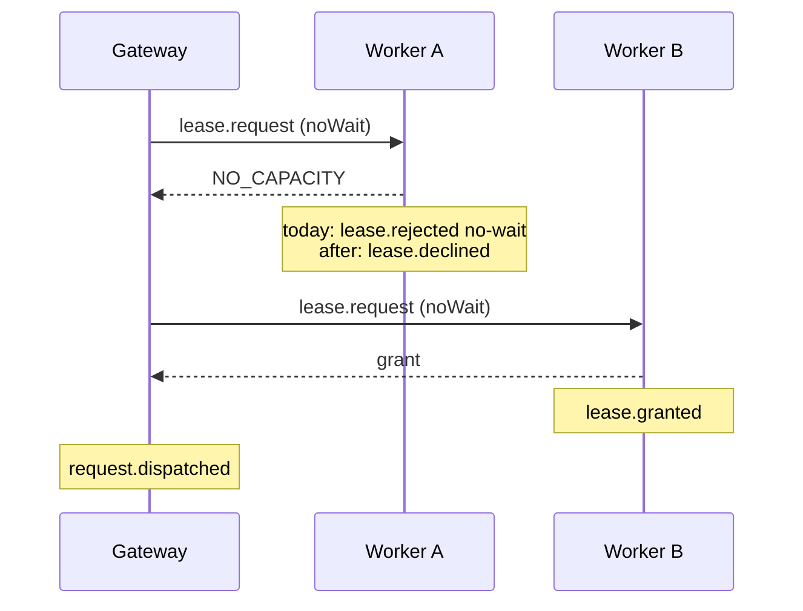

# 0021. A gateway dispatch is a probe, and the worker's lease events name the fleet request

- **Status:** Accepted — not yet implemented
- **Date:** 2026-10-08
- **Issue:** [#329](https://github.com/callstackincubator/simlock/issues/329)
- **Supersedes:** [ADR
  0016](0016-usage-figures-are-derived-on-read-from-the-event-history.md)
  §6's join rule (its second paragraph). The rest of §6 stands.
- **Depends on:** [ADR 0005](0005-gateway-and-worker-modes.md) requirements
  11, 12 and 27a, [ADR 0009](0009-gateway-routing-is-a-list-of-stages.md)
  §5, [ADR 0014](0014-an-event-has-one-id-minted-where-the-fact-happened.md)
  for `workerId` on a relayed event.

## Context

A gateway sends every request to a worker as `lease.request` with `noWait:
true` (ADR 0005 requirement 12). Some refusals don't end the request; the
gateway tries again elsewhere:

- an immediate `NO_CAPACITY`, which is a stale view (requirement 11);
- `UNKNOWN_MODEL`, `RUNTIME_MISSING` or `NO_DRIVER` before any progress
  push (ADR 0009 §5).

In each of these cases the request stays in the fleet queue.

The worker does not know that. It handles the request like any `--no-wait`
caller's: it emits `lease.requested`, then `lease.rejected` with reason
`no-wait` or `unknown-model`. Both are relayed to the gateway. The history
then records a final rejection for a request that another worker later
granted, or that is still waiting.

ADR 0016 §6 joins a fleet request to its outcome by position: the first
relayed answer for the namespaced requester after `request.dispatched`.
That fails two ways:

- a relayed refusal from a worker the gateway moved past is taken as the
  outcome;
- `request.dispatched` is emitted when the grant or the first progress push
  reaches the gateway, so a warm grant's relayed `lease.granted` is older
  than the dispatch it should follow.

The gateway never tells the worker which fleet request a dispatch serves,
so no id joins the two records. The same refusals also inflate a worker's
own figures: every stale-view refusal counts as a rejected request that no
caller ever saw.

## Decision

### 1. A gateway dispatch is a probe and carries the fleet request id

`lease.request` gains an optional `fleetRequestId`. Only the gateway's own
uplink session may set it, as with `owner` (requirement 27a). Any other
session that sets it is refused with `FORBIDDEN`.

The gateway sets it on every dispatch, to its own request id. A request
that carries it is a **probe**. A probe never waits; the gateway keeps
sending `noWait: true`. Its RPC answer is unchanged, so the gateway's walk
(requirement 11, ADR 0009 §5) works as it does today.

### 2. A refused probe is declined, not rejected

A probe that the worker refuses with one of the codes the gateway retries
on emits `lease.declined` instead of `lease.rejected`. Those codes are
`NO_CAPACITY`, `UNKNOWN_MODEL`, `RUNTIME_MISSING` and `NO_DRIVER`, before
the first progress push. The payload is `{ requestId, fleetRequestId,
requester, reason }`, with the same reason values `lease.rejected` uses.

Any other refusal of a probe is still `lease.rejected`: `already-leased`,
`lease-id-taken`, a failure after a progress push, a boot timeout. The
gateway treats each of these as the request's terminal failure.

The set of retried codes is defined once, in the contract. The gateway's
walk and the worker's choice of event both read it, so the two cannot
disagree about which refusals end a request.

### 3. Every lease event of a probe names the fleet request

The worker adds `fleetRequestId` to every lease event it emits for a probe:

- `lease.requested`,
- `lease.granted`,
- `lease.rejected`,
- `lease.declined`.

A probe is never queued, so there is no `lease.queued`. Later events of the
lease (`lease.renewed`, `lease.released`, `lease.expired`) are joined by
`leaseId` as today. The field is additive on the existing events (events
rule 6).

### 4. Usage joins a fleet request by id

This replaces ADR 0016 §6's join rule. On a gateway, a fleet request's
outcome is the relayed `lease.granted` or `lease.rejected` whose
`fleetRequestId` is the gateway's request id. Order and timestamps play no
part, and `request.dispatched` is not needed for the join. A relayed
`lease.declined` is never an outcome. A request with no such event is open.
Refusals the gateway makes itself (its own `no-wait`, `timeout`,
`cancelled`) are its own `lease.rejected` events, as today.

On a worker, a request that ends in `lease.declined` is counted under a
`declined` figure. It is not counted under requests or rejections, and it
gives no wait sample.

### 5. Protocol +1, and an older worker is incompatible

A worker without `fleetRequestId` would refuse the field, and its events
would not carry it. The protocol therefore moves up by one, and a worker on
the previous version is `incompatible` with the gateway, as with every
other change to what the gateway sends a worker (`src/contract/protocol.ts`).
There is no shim.

## Consequences

- A worker in a fleet no longer emits `lease.rejected` for a stale-view or
  cannot-serve refusal from the gateway. A consumer that counted those
  rejections sees `lease.declined` instead. The emission changes, not the
  payload. Both `EVENTS.md` files say so.
- `simlock events` on a worker shows each probe that missed as
  `lease.declined`, so an operator can tell gateway traffic that went
  elsewhere from a refusal a caller saw.
- The fleet join in `usage.get` is one id lookup. The rule about the first
  answer after a dispatch is gone.
- `usage.get` gains a `declined` count, per platform and per worker.
- A gateway and its workers must upgrade together.

## Alternatives considered

- **A public `--if-possible` flag on `simlock lease`.** Rejected: a user's
  `--no-wait` refusal is a real rejection that the caller sees. Only the
  gateway's probe is not.
- **Keep `lease.rejected` and add `fleetRequestId` only.** Rejected: the
  join would be fixed, but a worker's own history would still record
  refusals that no caller saw as rejections.
- **Tighten the positional join instead.** Rejected: the dispatch event
  follows a warm grant, so position cannot tell a stale refusal from the
  outcome. It also leaves the worker's figures wrong.
- **A shim for older workers.** Rejected: no other gateway-to-worker change
  kept one, and a fleet that mixes versions gets figures that are wrong
  without saying so.
