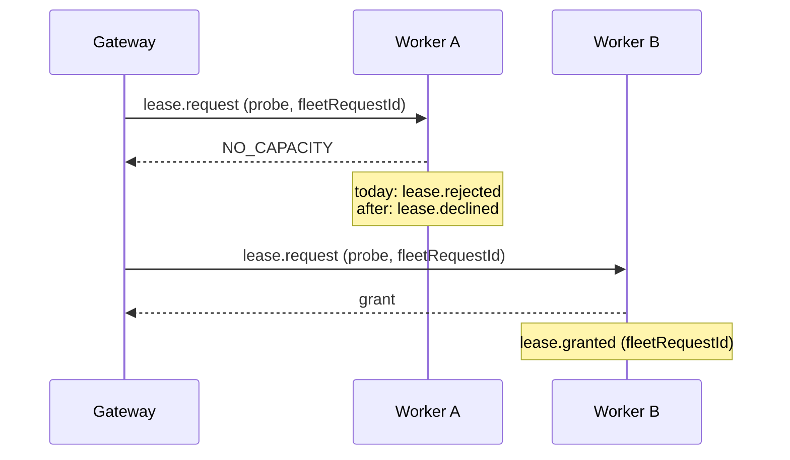

# 0021. A gateway dispatch is a probe, and the worker's lease events name the fleet request

- **Status:** Accepted — not yet implemented
- **Date:** 2026-10-08
- **Issue:** [#329](https://github.com/callstackincubator/simlock/issues/329)
- **Supersedes:** [ADR
  0016](0016-usage-figures-are-derived-on-read-from-the-event-history.md)
  §6's rules on which relayed `lease.rejected` counts, on how a fleet request
  is joined to its outcome, and its line "The gateway emits no rejection of
  its own for a request that failed on its worker". The rest of §6 stands:
  request facts come from the gateway's own events, device facts from
  relayed ones.
- **Depends on:** [ADR 0005](0005-gateway-and-worker-modes.md) requirements
  11, 12 and 27a, [ADR 0009](0009-gateway-routing-is-a-list-of-stages.md)
  §5, [ADR 0014](0014-an-event-has-one-id-minted-where-the-fact-happened.md)
  for `workerId` on a relayed event, [ADR
  0020](0020-a-requester-may-choose-its-lease-id.md) for a forwarded
  `leaseId`.

## Context

A gateway sends every request to a worker as `lease.request` with `noWait:
true` (ADR 0005 requirement 12). Some refusals do not end the request; the
gateway tries another worker:

- an immediate `NO_CAPACITY`, which is a stale view (requirement 11);
- `UNKNOWN_MODEL`, `RUNTIME_MISSING` or `NO_DRIVER` before any progress
  push (ADR 0009 §5).

The request then fails only when no worker is left. A `noWait` caller gets
one more walk.

The worker does not know any of that. It handles the request like a local
`--no-wait` caller's, and emits `lease.requested` followed by `lease.rejected`
with reason `no-wait` or `unresolvable-spec`. Both are relayed to the
gateway. The history then records a final rejection for a request that
another worker granted, or that is still waiting.

Who records the end of a fleet request also differs by path:

- When the gateway ends it itself (`timeout`, `cancelled`, `no-wait`,
  `no-worker`), the gateway emits `lease.rejected`.
- When it ends on a worker's failure, the gateway emits nothing and relies
  on the worker's relayed `lease.rejected`. This covers a terminal refusal,
  a failure after progress, the last cannot-serve refusal,
  `WORKER_UNREACHABLE` and `INTERNAL`. For the last two the worker may have
  emitted nothing at all.

ADR 0016 §6 joins a fleet request to its outcome by position: the first
relayed answer for the namespaced requester after `request.dispatched`.
That fails in three ways:

- a refusal relayed from a worker the gateway moved past counts as the
  outcome;
- a warm grant's relayed `lease.granted` is older than the
  `request.dispatched` it should follow, because the gateway emits
  `request.dispatched` when the grant reaches it;
- a request that failed before any progress has no `request.dispatched` at
  all.

The gateway never tells the worker which fleet request a dispatch serves,
so no id joins the two records. The same refusals inflate a worker's own
figures: every stale-view refusal counts as a rejected request that no
caller saw.

## Decision

### 1. A gateway dispatch is a probe and carries the fleet request id

`lease.request` gains an optional `fleetRequestId`: a string of at most 200
characters, the same bound as `idempotencyKey`. Only the gateway's own
uplink session may set it, and any other session that sets it is refused
with `FORBIDDEN`. Requirement 27a lets any `admin` session set `owner`, but
the worker already accepts `owner` only on the uplink session; this field
follows that narrower rule from the start. The field is not part of the
MCP lease tool's input or the HTTP lease body, so neither offers it.

The gateway sets `fleetRequestId` to its own request id on every dispatch.
A request that carries it is a **probe**. A probe must also carry `noWait:
true`; one without it is refused with `BAD_REQUEST` before it is stored. The
RPC answer to a probe is unchanged, so the gateway's walk (requirement 11,
ADR 0009 §5) works as it does today.

### 2. A worker declines a probe, and never rejects one

A worker never owns the outcome of a probe; the gateway does. So every
refusal or failure of a probe on a worker is recorded as `lease.declined`,
never `lease.rejected`, whatever the reason and however far the work got.
That covers:

- `no-wait`, `unresolvable-spec`, `already-leased`, `lease-id-taken`;
- `boot-timeout`, `killed`, and `daemon-restarted` at the next start.

The payload is `{ requestId, fleetRequestId, requester, reason }`, with the
reasons `lease.rejected` uses. The worker makes no judgement about whether
the gateway will retry: the event depends only on whether the request is a
probe. A local request is rejected exactly as today.

The stored request record keeps `fleetRequestId`, so a probe settled at the
next start still names it.

### 3. Every lease event of a probe names the fleet request

The worker adds `fleetRequestId` to each lease event it emits for a probe:
`lease.requested`, `lease.granted` and `lease.declined`. A probe is never
queued, so there is no `lease.queued`. Later events of the lease
(`lease.renewed`, `lease.released`, `lease.expired`) are joined by `leaseId`
as today. On the existing events the field is additive (events rule 6).

### 4. The gateway records every fleet request that ends without a grant

Whenever a fleet request ends without a grant, the gateway emits its own
`lease.rejected` for it, exactly once:

- each case it covers today (`timeout`, `cancelled`, `no-wait`,
  `no-worker`, `lease-id-taken`);
- the last cannot-serve refusal, as `unresolvable-spec`, whether or not the
  request had been queued;
- every other failure on the worker it went to, as the new reason
  `worker-failed`. That covers a terminal refusal, a failure after progress,
  `WORKER_UNREACHABLE`, `INTERNAL` and a dispatch timeout.

A `worker-failed` rejection carries `code`, the error code the caller got.
The worker that failed is told by the relayed `lease.declined` with the same
`fleetRequestId`.

### 5. Usage joins a fleet request by id

This replaces ADR 0016 §6's join. On a gateway, a fleet request ends in one
of two ways:

- **Rejected:** the gateway's own `lease.rejected` for its request id. It
  wins over any relayed grant, so a grant that arrives after the gateway gave
  up is not that request's outcome.
- **Granted:** the relayed `lease.granted` whose `fleetRequestId` is the
  gateway's request id.

A gateway can give back a grant and try again. It does this when the
worker's lease id is not the `leaseId` the caller chose (ADR 0020), so two
grants then carry the same `fleetRequestId`. The outcome is the grant whose
`leaseId` is the chosen one. To make that possible, the gateway's
`lease.requested` gains `leaseId` when the caller chose one. Without a
chosen id there is no retry after a grant, so at most one grant carries the
`fleetRequestId`.

A request with neither is open. Order, timestamps and `request.dispatched`
play no part in the join. Relayed `lease.declined` events are never an
outcome. They count under a `declined` figure for the worker that emitted
them.

On a worker, a request that ended in `lease.declined` counts under
`declined`, not under requests or rejections, and gives no wait sample.

### 6. Protocol +1, and an older worker is incompatible

A worker without `fleetRequestId` would refuse the field, and its events
would not carry it. The protocol therefore moves up by one, and a worker on
the previous version is `incompatible` with the gateway, as with every
other change to what the gateway sends a worker (`src/contract/protocol.ts`).
There is no shim.

## Consequences

- A worker in a fleet no longer emits `lease.rejected` for gateway traffic.
  A consumer that counted those rejections sees `lease.declined` instead.
  The emission changes, not the payload. Both `EVENTS.md` files say so.
- `simlock events` on a worker shows each probe that missed as
  `lease.declined`, so an operator can tell gateway traffic that went
  elsewhere from a refusal a local caller saw.
- A gateway's `simlock events` shows one `lease.rejected` for every fleet
  request that failed, including failures on a worker. `lease.rejected`
  gains the reason `worker-failed` and the field `code`. The gateway's
  `lease.requested` gains `leaseId`.
- The fleet join in `usage.get` is an id lookup. The rule about the first
  answer after a dispatch is gone. `usage.get` gains a `declined` count,
  per platform and per worker.
- A gateway and its workers must upgrade together.

## Alternatives considered

- **A public `--if-possible` flag on `simlock lease`.** Rejected: a user's
  `--no-wait` refusal is a real rejection that the caller sees. Only the
  gateway's probe is not.
- **The worker declines only the refusals the gateway retries.** Rejected:
  the worker would have to repeat the gateway's retry rule, including the
  moment of the first progress push. A push can be dropped on the way, and
  then the two sides disagree. The worker would also need to map errors to
  codes, which only the daemon does today. And a terminal failure on a
  worker would still leave the gateway with no event of its own.
- **Keep `lease.rejected` and add `fleetRequestId` only.** Rejected: the
  join would be fixed, but a worker's own history would still record
  refusals no caller saw as rejections.
- **Tighten the positional join.** Rejected: a warm grant comes before the
  dispatch event, and a failure before progress has no dispatch event.
- **A shim for older workers.** Rejected: no other gateway-to-worker change
  kept one, and a fleet that mixes versions would get wrong figures without
  saying so.
