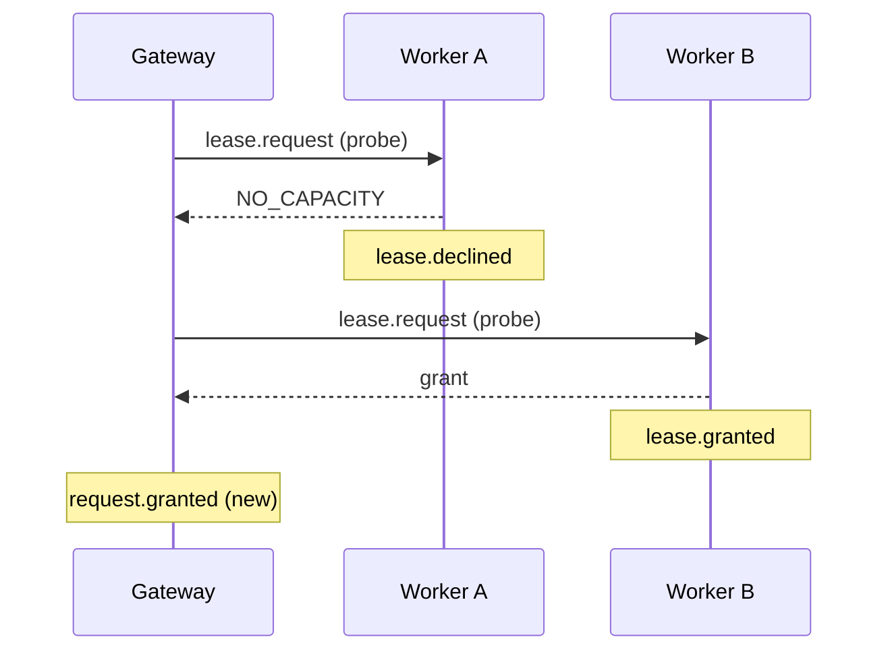

# 0021. A gateway dispatch is a probe, and the gateway records every fleet request's outcome

- **Status:** Accepted — not yet implemented
- **Date:** 2026-10-08
- **Issue:** [#329](https://github.com/callstackincubator/simlock/issues/329)
- **Supersedes:** [ADR
  0016](0016-usage-figures-are-derived-on-read-from-the-event-history.md)
  §6's rules on:
  - which relayed `lease.rejected` counts;
  - how a fleet request is joined to its outcome;
  - where a fleet grant is counted from;
  - the line "The gateway emits no rejection of its own for a request that
    failed on its worker".

  The rest of §6 stands: request facts come from the gateway's own events,
  device facts from relayed ones.
- **Depends on:** [ADR 0005](0005-gateway-and-worker-modes.md) requirements
  11, 12, 27a and 30, [ADR
  0009](0009-gateway-routing-is-a-list-of-stages.md) §5, [ADR
  0014](0014-an-event-has-one-id-minted-where-the-fact-happened.md) for
  `workerId` on a relayed event, [ADR
  0020](0020-a-requester-may-choose-its-lease-id.md) for a forwarded
  `leaseId`.

## Context

A gateway sends every request to a worker as `lease.request` with `noWait:
true` (ADR 0005 requirement 12). Some refusals do not end the request; the
gateway tries another worker:

- an immediate `NO_CAPACITY`, which is a stale view (requirement 11);
- `UNKNOWN_MODEL`, `RUNTIME_MISSING` or `NO_DRIVER` before any progress
  push (ADR 0009 §5).

The request fails only when no worker is left. A `noWait` caller gets one
more walk.

The worker does not know any of that. It handles the request like a local
`--no-wait` caller's: `lease.requested`, then `lease.rejected` with reason
`no-wait` or `unresolvable-spec`. Both are relayed to the gateway. The
history then records a final rejection for a request that another worker
granted, or that is still waiting.

The gateway's own record of a fleet request is also incomplete:

- It emits `lease.rejected` only when it ends the request itself
  (`timeout`, `cancelled`, `no-wait`, `no-worker`).
- When the request fails on a worker, it emits nothing and relies on the
  worker's relayed event. For `WORKER_UNREACHABLE` there may be none.
- It emits no event when it grants. The only grant fact is the worker's
  relayed `lease.granted`. That event is stamped by the worker's clock, and
  it is missing when the worker's event subscription is down.

ADR 0016 §6 joins a fleet request to its outcome by position: the first
relayed answer for the namespaced requester after `request.dispatched`. That
fails in three ways:

- a refusal relayed from a worker the gateway moved past counts as the
  outcome;
- a warm grant comes before the `request.dispatched` it should follow;
- a request that failed before any progress has no `request.dispatched`.

The same refusals inflate a worker's own figures: every stale-view refusal
counts as a rejected request that no caller saw.

## Decision

### 1. A gateway dispatch is a probe and carries the fleet request id

`lease.request` gains an optional `fleetRequestId`: a string of at most 200
characters, the same bound as `idempotencyKey`. Only the gateway's own
uplink session may set it, and any other session that sets it is refused
with `FORBIDDEN`. A gateway's own `lease.request` handler refuses it from
every session, because gateways do not chain. Requirement 27a lets any `admin` session set `owner`, but
the worker already accepts `owner` only on the uplink session. This field
follows that narrower rule from the start. The field is not part of the MCP
lease tool's input or the HTTP lease body.

The gateway sets it to its own request id on every dispatch. A request that
carries it is a **probe**. A probe must carry `noWait: true`, and one
without it is refused with `BAD_REQUEST` before it is stored. A probe is
never queued on the worker. Where the worker would queue a request (after a
second failed provision, for example), it declines a probe instead, with
reason `no-wait`, and answers `NO_CAPACITY`.

The RPC answer to a probe is unchanged, so the gateway's walk works as
today (requirement 11, ADR 0009 §5).

### 2. A worker declines a probe, and never rejects one

A worker never owns the outcome of a probe; the gateway does. Every refusal
or failure of a probe on a worker is therefore `lease.declined`, never
`lease.rejected`, whatever the reason and however far the work got. That
covers:

- `no-wait`, `unresolvable-spec`, `already-leased`, `lease-id-taken`;
- `boot-timeout`, `killed`, and `daemon-restarted` at the next start.

The payload is `{ requestId, fleetRequestId, requester, requestSpec, reason
}`, with `lease.rejected`'s reasons. `requestSpec` is there for the same
reason as on `lease.rejected`: a decline at admission has no
`lease.requested`.

The worker makes no judgement about whether the gateway will retry: the
event depends only on whether the request is a probe. Every worker site
that emits `lease.rejected` applies that one condition. A local request is
rejected exactly as today. The stored request record keeps `fleetRequestId`,
so a probe settled at the next start still names it.

### 3. A probe's lease events name the fleet request

The worker adds `fleetRequestId` to `lease.requested`, `lease.granted` and
`lease.declined` for a probe. Later events of the lease are joined by
`leaseId` as today. On the existing events the field is additive (events
rule 6). Usage does not need it, because §4 records the outcome on the
gateway. It lets an operator reading a worker's events see which fleet
request a probe served.

### 4. The gateway records every fleet request's outcome

A fleet request ends in exactly one event of the gateway's own, by the
gateway's clock:

- **`request.granted`** `{ requestId, worker, leaseId, workerLeaseId }`,
  emitted when the gateway hands the grant to its caller: after the lease
  index accepted it, and only if the waiter was still open. `leaseId` is the
  gateway lease id and `workerLeaseId` the worker's.

  A grant that hands nothing to a caller emits nothing:
  - one given back for ADR 0020's mismatched id;
  - one the lease index refused, which ends in `lease-id-taken`;
  - one that lands after the waiter was settled (timeout, cancel, or the
    gateway stopping).
- **`lease.rejected`**, for every other ending:
  - the cases it covers today (`timeout`, `cancelled`, `no-wait`,
    `no-worker`, `lease-id-taken`);
  - the last cannot-serve refusal, as `unresolvable-spec`, whether or not
    the request had been queued;
  - every other failure on the worker it went to, as the new reason
    `worker-failed`, with `code` (the error code the caller got) and
    `worker`. That covers a terminal refusal, a failure after progress,
    `WORKER_UNREACHABLE`, `INTERNAL` and a dispatch timeout.

The worker field on these two events is named `worker`, not `workerId`.
`payload.workerId` is the only mark of a relayed event (ADR 0014 §6), so a
gateway's own event must not carry it. The worker link refuses a
`request.granted` pushed by a worker, as it refuses the gateway's other own
event names.

A gateway that stops or crashes loses its open requests without an event,
because its queue lives in memory (requirement 30). Usage closes them at the
gateway's next `daemon.started` (§5).

### 5. Usage on a gateway reads the outcome from the gateway's own events

This replaces ADR 0016 §6's join and its source for fleet grants.

**Outcome.** A fleet request's outcome is its gateway `request.granted` or
`lease.rejected`, by request id. A request with neither, followed by a
later `daemon.started` of the gateway itself (not a relayed one), ended at
that start and counts as rejected `daemon-restarted`. Any other request with neither is open.

**Wait.** A fleet request's wait runs from its `lease.requested` to its
outcome, both by the gateway's clock.

**Device facts.** These come from the relayed `lease.granted` with that
`workerId` and `workerLeaseId`: the grant source, and held time to that
lease's relayed release or expiry, all by the worker's clock.

- If the relayed grant is missing, the grant still counts, with source
  `unknown`, and gives no held sample.
- Turnaround is wait plus held, so it never subtracts one host's clock from
  another's.

**Per worker.** A grant counts for the `worker` of its `request.granted`,
and a `worker-failed` rejection for its own `worker`. Relayed
`lease.declined` events count per worker and per platform (from
`requestSpec`) under `declined`.

`declined` counts decline events, not requests: one fleet request may be
declined by several workers, or by one worker more than once. A decline
belongs to the window its `lease.declined` falls in. Relayed
`lease.granted`, `lease.rejected`, `lease.declined`, `request.dispatched`
and `daemon.started` never decide a fleet request's outcome.

On a worker, the figures separate the two kinds of request:
- **`requests`** counts only local requests, those whose `lease.requested`
  has no `fleetRequestId`.
- **`probes`** counts the ones that do.
- **Grants, source and held time** count both kinds, since both use the
  worker's devices.
- **`declined`** counts the worker's `lease.declined` events. A probe never
  gives a wait sample on the worker; its wait is the gateway's.

### 6. Protocol +1, and an older worker is incompatible

A worker without `fleetRequestId` would refuse the field. The protocol
therefore moves up by one, and a worker on the previous version is
`incompatible` with the gateway, as with every other change to what the
gateway sends a worker (`src/contract/protocol.ts`). There is no shim.

## Consequences

- A worker in a fleet no longer emits `lease.rejected` for gateway traffic.
  A consumer that counted those rejections sees `lease.declined` instead.
  The emission changes, not the payload. Both `EVENTS.md` files say so.
- `simlock events` on a worker shows each probe that missed as
  `lease.declined`, so an operator can tell gateway traffic that went
  elsewhere from a refusal a local caller saw.
- A gateway's `simlock events` shows one `request.granted` or one
  `lease.rejected` for every fleet request that ended while it ran.
  `lease.rejected` gains the reason `worker-failed` and the fields `code`
  and `worker`.
- Fleet figures no longer depend on the worker's event subscription for
  counts and waits, or on the two hosts' clocks agreeing. Only the grant
  source and held time need the relayed events.
- `usage.get` gains a `declined` count, per platform and per worker, a
  `probes` count on a worker, and an `unknown` grant source.
- A gateway and its workers must upgrade together.

## Alternatives considered

- **A public `--if-possible` flag on `simlock lease`.** Rejected: a user's
  `--no-wait` refusal is a real rejection that the caller sees. Only the
  gateway's probe is not.
- **The worker declines only the refusals the gateway retries.** Rejected:
  the worker would have to repeat the gateway's retry rule, including the
  moment of the first progress push. A push can be dropped on the way, and
  then the two sides disagree. The worker would also need to map errors to
  codes, which only the daemon does today.
- **Join a fleet grant through the relayed `lease.granted` by
  `fleetRequestId`.** Rejected: a grant would vanish from the figures when
  the worker's subscription is down, and the wait would subtract one host's
  clock from another's.
- **The gateway emits `lease.rejected` at stop.** Rejected: it would not
  cover a crash. A rule applied when the figures are read covers both.
- **Tighten the positional join.** Rejected: a warm grant comes before the
  dispatch event, and a failure before progress has no dispatch event.
- **A shim for older workers.** Rejected: no other gateway-to-worker change
  kept one, and a fleet that mixes versions would get wrong figures without
  saying so.
