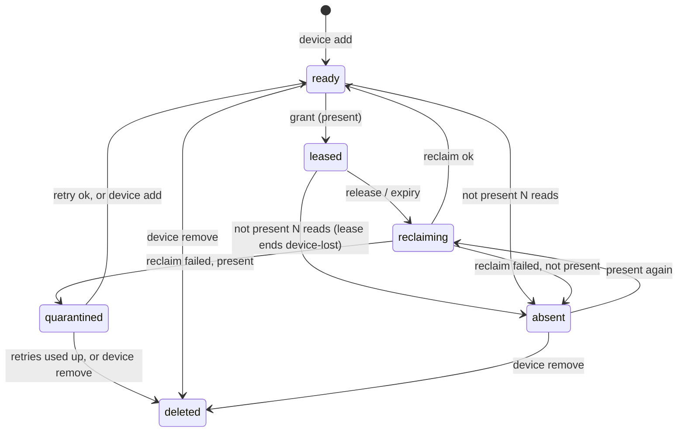
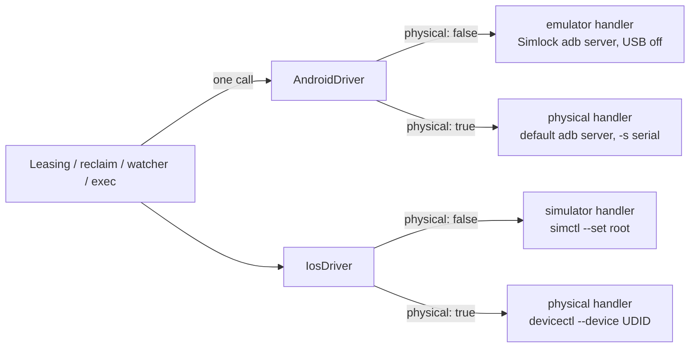

# 0022. A physical device is a second device type the core knows

- **Status:** Proposed
- **Date:** 2026-10-10
- **Issue:** [#428](https://github.com/callstackincubator/simlock/issues/428)
- **Supersedes:** nothing. Amends [ADR 0001](0001-simlock-owned-device-roots.md):
  root membership stops being the only proof of ownership (§3), and the
  Android driver uses a second adb server for physical devices (§5).
  Amends [ADR 0015](0015-a-lease-request-is-a-set-of-constraints.md) §3: a
  physical device's class is recorded at enrollment, not read from the
  catalog (§6). Amends [ADR
  0019](0019-startup-ends-every-lease-whose-device-is-not-running.md) §1–2
  for physical devices (§7). Amends the agent rules listed in §11.
- **Depends on:** ADR 0001, 0003, 0015, 0017, 0018, 0019.

## Context

Simlock leases simulators and emulators it creates itself. Issue #428 adds
real iPhones, iPads and Android phones that an admin plugs in by USB and
enrolls by ID.

Every part of the core assumes Simlock created the device it holds:

- idle cleanup, nuke and quarantine give-up destroy devices;
- startup, the health monitor and `doctor --fix` mark a device that is not
  in the root as `deleted`;
- `doctor --purge-orphans` destroys whatever is in a root and not in the
  registry;
- ownership is proven by root membership (safety rules 1, 7, 8), and the
  Android driver talks only to Simlock's own USB-blind adb server (rule 9).

A physical device is in no root, and Simlock cannot create, boot, shut down
or destroy it. Passed through any path above it would be written `deleted`,
which silently unenrolls it. `ARCHITECTURE.md` hoped a physical-device
driver would need no core changes; it does, because those paths must know
a device cannot be destroyed.

Two facts about adb on macOS shape §5. Only one process can hold a USB
device: adb's macOS backend opens it with `USBInterfaceOpen`, which is
exclusive, and retries a failed open every second (`client/usb_osx.cpp`).
The default adb server, which any `adb` command and Android Studio start,
tries to open every USB Android device. And `adb detach`, which would let a
server give one device up, works only on the libusb backend, which
platform-tools 37.0.1 disabled on macOS.

## Decision

### 1. A device record is a union; `physical` tells the two apart

```ts
type VirtualDevice  = { physical: false; state: VirtualState;  spec: VirtualSpec;  … };
type PhysicalDevice = { physical: true;  state: PhysicalState; spec: PhysicalSpec;
                        enrolledApps: readonly string[]; reclaimingSince?: number; … };
type DeviceRecord = VirtualDevice | PhysicalDevice;

type SharedState   = "ready" | "leased" | "reclaiming" | "quarantined";
type VirtualState  = SharedState | "provisioning" | "shutdown" | "deleted";
type PhysicalState = SharedState | "absent" | "deleted";
```

`physical` is part of the spec, so `sameSpec` never matches a physical
device with a virtual one. A stored record with no `physical` field loads
as virtual. `PhysicalSpec` carries platform, model, OS version and class;
it has no mode and no image tag.

A physical device's canonical ID (§6) is its `driverDeviceId` and its
`address`. Its registry `id` is generated as for any device (`dev_…`).
Commands that name a physical device take the canonical ID.

### 2. Each type has its own state machine



The virtual machine is unchanged. The physical one has no `provisioning`
or `shutdown`. `deleted` on a physical record means unenrolled: the record
stays, like every deleted record, and nothing on the device changed.

`device add` of an enrolled device re-records its apps and is allowed from
`ready`, `absent` and `quarantined`; it ends in `ready` (from `absent` only
once the device is present), and from `quarantined` it stops the retries.
`device add` and `device remove` are refused from `leased` and
`reclaiming`. Each holds the device's operation claim from its first read
to its write, so a grant, a reclaim or a retry cannot interleave.

Ending a lease because its device is not present is one registry write
that ends the lease and moves the device to `absent`, as today's "end the
lease and mark the device missing" does for a virtual device.

`reclaiming` is entered from `leased` (by `beginRelease`) and from
`absent`. A physical record stamps `reclaimingSince` on both entries;
`transitionEnteredAt` reads it. `lastLeaseEndedAt` is stamped only when a
lease ends.

A quarantined physical device that is not present keeps its state, and its
retry timer waits until it is present. It never becomes `absent`, so
unplugging it cannot reset its retries.

### 3. Ownership of a physical device is its enrollment record

Root membership stays the proof of ownership for virtual devices. For a
physical device the proof is a registry record an admin created with
`device add`, keyed by the canonical ID. Nothing else: not a name, not
being plugged in.

That record allows exactly one destructive act: uninstalling a
user-installed app that is not on the record's enrollment app list.
Simlock never erases, reboots, shuts down or unpairs a physical device, and
never runs a command on a device with no record.

`device.add` and `device.remove` are `admin` operations. An `agent` session
gets `FORBIDDEN`: an agent that could re-enroll its leased device would
make its own app part of the starting point.

### 4. Virtual-only operations take only virtual devices

`provision`, `shutdown`, `destroy`, the warm pool, idle cleanup, nuke's
shutdown and delete steps, `doctor --purge-orphans`, the orphan and foreign-state findings, the
health monitor's crash recovery, capacity limits and the RAM budget take
`VirtualDevice`. Passing a physical one does not compile. The registry
offers one read of virtual devices that these callers use; none writes the
filter itself.

Shared by both types: the lease path (grant, queue, release, expiry, the
planner's "grant a ready device that fits"), reclaim, quarantine, the
driver's `estimate` for a reclaim, and doctor's stalled-transition finding.
A physical reclaim that outlives its estimate is quarantined like a
virtual one.

The planner never boots, provisions or evicts for a physical request: it
grants, waits or refuses. A virtual request never fits a physical device,
and the reverse.

A physical device is always reusable: `lease.identity` does not apply.

`nuke` ends a lease on a physical device as it ends any lease, and the
device then gets a normal reclaim. `nuke` never unenrolls, erases or
otherwise touches a physical device.

### 5. One driver per platform, routing by `physical` inside



The core keeps one driver per platform. Drivers receive a `DriverDevice`,
never a registry record; a physical one adds `physical: true` and the
enrollment app list. The driver routes on `physical`:

```ts
type VirtualDriverDevice  = DriverDevice & { physical: false };
type PhysicalDriverDevice = DriverDevice & { physical: true; enrolledApps: readonly string[] };

interface Driver {
  // both types
  reclaim(device: VirtualDriverDevice | PhysicalDriverDevice, …): Promise<ReclaimResult>;
  estimate(estimate: DriverEstimate, spec: DeviceSpec): number;
  passthrough(tool: string, device: … | undefined, args: readonly string[], …): PassthroughCommand;
  leaseEnvironment(device: VirtualDriverDevice | PhysicalDriverDevice): Readonly<Record<string, string>>;
  readonly passthroughTools: readonly string[];      // iOS: simctl, devicectl; Android: adb
  // virtual only
  provision(spec: VirtualSpec, …): Promise<…>;
  shutdown(device: VirtualDriverDevice): Promise<void>;
  destroy(device: VirtualDriverDevice): Promise<void>;
  listManaged(): Promise<…>;                          // root contents, as today
  // physical only
  inspectPhysical(id: string): Promise<PhysicalInspection>;  // device add
  listPresentPhysical(enrolled: readonly string[]): Promise<PresentPhysical[]>;
                                                       // watcher, grant, startup
}
```

A driver may answer to several tool names. `passthrough` with no device is
today's local `simlock simctl` / `simlock adb`, unchanged. `device.exec`
passes the lease's device. For a physical Android device it runs `adb -s
<serial>` against the default server. For a physical iOS device the tool
is `devicectl`: the iOS driver runs `xcrun devicectl` and adds `--device
<UDID>` where the verb takes one; `devicectl` on a virtual lease, and
`simctl` on a physical one, are refused. Locally an agent runs plain
`adb` or `devicectl`; no wrapper is needed. Each physical handler has its
own refusal list, and `devicectl` arguments that read or write host files
(`--json-output`, `device copy`) are refused over `device.exec`. There is
no isolation between lease holders: a command that names another device's
ID is not stopped.

`listPresentPhysical` is given the enrolled canonical IDs and answers only
for them; a device that is not enrolled gets no entry and no command.

`leaseEnvironment` for a physical Android device sets `ANDROID_SERIAL` and
`ANDROID_ADB_SERVER_PORT=5037`, so an agent's adb never stays on Simlock's
emulator server; for a physical iOS device it sets `SIMLOCK_DEVICE_UDID`.

**adb.** Emulators keep Simlock's own server, unchanged (port 5038, USB
off). Physical Android devices go through the host's default server (port
5037), always with `-s <serial>`. Simlock's call may start that server, as
any `adb` command does; Simlock never stops it. Before its physical calls
Simlock reads the server's protocol version with `host:version` over the
socket, which does not restart the server. That protocol version is what
makes an adb client kill a server. If it differs from Simlock's adb,
Simlock sends no physical command, the devices read as not present, and
`doctor` names both protocol versions.

Every physical call has a time limit: 30 seconds for one read, 60 seconds
for one uninstall. A call past its limit fails as "not present" for a
read and as a reclaim failure for an uninstall. A hang cannot hold up the
virtual side of its driver.

### 6. Enrollment and matching

`device add --platform ios|android <id>`:

1. asks the platform's physical handler to inspect the ID over USB only;
2. resolves it to the canonical ID: the iOS UDID (from any ID devicectl
   accepts, e.g. the CoreDevice identifier), or the Android USB serial,
   read from the device's USB transport, never from the shape of the
   serial. A device reachable only over the network is refused;
3. treats a canonical ID that is already enrolled as that device, so one
   device can never have two records;
4. refuses a virtual device's ID, an Apple TV, Apple Watch or Apple Vision
   device, an iOS device below 17, and a device that is not trusted or not
   in developer mode;
5. records model, OS version (the API level on Android), class and the
   user-installed apps, and writes the record in `ready`. On Android these
   are `pm list packages -3` for the current user. On iOS they are the apps
   devicectl lists by default: apps installed by Xcode or devicectl. App
   Store and TestFlight apps are never recorded and never touched.

A locked iPhone is refused at enrollment ("unlock it and try again"), and
so is an emulator on the default adb server (not a USB device).

The class is the device's own report: iPad is `tablet`, otherwise `phone`.
Every Android device is `phone`.
It is stored on the record and carried on the status device entry and the
worker view, so the gateway can match it. A request with no class means
`phone`, as for virtual requests.

Physical requests skip create-spec resolution. A physical request that no
enrolled physical device in any state but `deleted` could match fails at
once with `UNKNOWN_MODEL` and "no enrolled physical device can match".
Otherwise it waits, or with `noWait` fails `NO_CAPACITY` as today.
`--os` matches exactly, as for virtual requests; "18.x" is the range
`>=18 <19`. `--device` ignores letter case.

Physical and virtual requests wait in separate lines. Virtual requests keep
today's order exactly. A device that becomes ready goes to the oldest
waiting physical request it matches, so a request for one model never waits
behind a request for another, and no virtual request waits behind a
physical one. A
waiting physical request whose last matching device is unenrolled fails
then, with the same `UNKNOWN_MODEL`. `mode`, `imageTag` and
`allowDownload: true` are refused with `physical` by the contract; the
platform's default mode does not apply.

On a gateway, `device add` and `device remove` carry a `worker` field
(`--worker` on the CLI) and are forwarded to that worker.

### 7. Presence: read at grant, watched always

A physical device is present when its handler lists it on USB, trusted
and usable: iOS paired, wired and unlocked; Android in state `device`.
"Not present" is a read; `absent` is the state. A read that is not present
carries a reason, kept on an absent record as `absentReason` and shown in
status:

| Reason | iOS | Android |
|---|---|---|
| `locked` | `devicectl device info lockState` | not detected: a locked Android device is present |
| `untrusted` | not paired, or trust lost | `adb devices` says `unauthorized` |
| `not-present` | not listed on USB | missing, or `offline` |

adb exposes no documented lock state, and adb installs and uninstalls work
on a locked Android device, so a locked one stays in rotation.

- **At grant**: a device not present is not granted, its state is left to
  the watcher, and the request tries the next match or waits.
- **The physical-device watcher** is part of leasing, because it ends
  leases. It runs whatever `health.enabled` says: without it, a free device
  that was unplugged would be granted. It reads every enrolled device every
  `health.probeIntervalMs`. A device read not present
  `health.stableObservations` times in a row is absent: a lease on it ends
  `device-lost`, and a `ready` one becomes `absent`. An `absent` device
  read present is reclaimed, and its OS version is read again. The watcher
  never transitions a device under an operation claim.
- **At startup** a leased or `ready` physical device keeps its state, and
  the watcher applies the same rule once the daemon is up. USB devices
  appear some seconds after a Mac boots; a restart alone never ends a
  physical lease. An unreadable platform is treated the same way. A
  physical device left `reclaiming` has its reclaim run again once it is
  present.

### 8. Reclaim and quarantine

Reclaim of a physical device lists its user-installed apps and uninstalls
each one not on the enrollment list. The `reclaim` strategy is `uninstall`.
A listed app that is missing is reported in the result, not restored.

If the reclaim fails, the reclaim itself reads presence once and commits:
`absent` when the device is not present (unplugged, untrusted, or a locked
iPhone), `quarantined` when it is present. Quarantine retries on the
existing backoff (`warmPool.quarantine.maxRetries`). When the retries run
out, the device is unenrolled (`deleted`), never destroyed.

### 9. Events

New events, past-tense facts emitted after commit:

- `device.enrolled`: id, platform, canonical ID, model, OS version, class,
  app count; `reenrolled: true` on a second enrollment.
- `device.absence-detected`: id, previous state, reason.
- `device.returned`: id, OS version.

Extended:

- `device.deleted.initiator` gains `operator` (`device remove`) and, for a
  physical device only, `quarantine` (retries used up); its payload carries
  `physical`. Its
  meaning becomes "removed from the registry, and from disk for a virtual
  device".
- `device.quarantine-abandoned` means "destroyed, or unenrolled for a
  physical device".
- `device.reclaimed.strategy` gains `uninstall`; its payload, and that of
  `device.quarantine-recovered`, gain `missingApps` for a physical device.
- A returned device whose reclaim fails while present emits
  `device.quarantined` only: no lease is involved.
- `request.dispatched` carries `physical`.
- Device payloads that carry a spec carry `physical`. A physical grant's
  `lease.granted.source` is `warm`: the device was ready and nothing booted.

### 10. Gateway

A gateway matches a physical request against the physical devices in its
workers' views, in any state but `deleted`. It fails at once with
`UNKNOWN_MODEL` when no worker's device could match. It sends the request
only to a worker with a matching `ready` device, and otherwise waits. The
routing stages that count free slots, RAM and free capacity are skipped for
a physical request, and a physical pick counts as a warm hit. A worker that
is restarting stays known by its last-read physical devices, as it stays
known by its last catalog. `device.exec` already goes to the worker that
holds the lease; the gateway adds nothing to it. There is no `simlock
devicectl` command: a remote iOS agent runs devicectl through exec over
HTTP or the client.

### 11. Rules amended

- Safety rule 1 gains: "A physical device is Simlock's to act on only
  through its enrollment record, and the only destructive act it allows is
  uninstalling a user-installed app not on the record's enrollment app
  list."
- Safety rule 7: "Reality" for a physical device is the platform tool's
  list of USB devices, read only for enrolled canonical IDs.
- Safety rule 8 gains: "A physical device is Simlock's because an admin
  enrolled it; `listPresentPhysical()` answers only for enrolled IDs."
- Safety rule 9 gains: "Physical Android devices are reached through the
  host's default adb server, never Simlock's; Simlock never stops it and
  never restarts one of another protocol version."
- Architecture rule 3 is unchanged: no driver is added, and platform
  knowledge stays in the driver modules. A new device type is not a new
  driver; the core learns that a device may be physical, and that is a
  decision recorded here, not a leak. `ARCHITECTURE.md`'s litmus no longer
  names physical devices as its example, and the "Physical-device driver"
  idea leaves `IDEAS.md`.

## Consequences

- The core changes wherever it iterates devices. The compiler finds every
  place; each gets the virtual read, a branch, and a test.
- Physical devices have no accident boundary: every tool on the host sees
  them, unlike simulators in Simlock's set and emulators on its server.
  KNOWN-PITFALLS gets an entry.
- Two Simlock instances can enroll the same device and each uninstalls
  the other's apps. Accepted, documented, not guarded.
- An adb protocol mismatch on the default server takes Android physical
  devices out of rotation until it is fixed. Every adb release in years
  speaks protocol 41, so this is rare.
- One driver per platform couples failure: a driver that fails to start
  (a bad root, the private adb port taken) takes its physical devices
  down too.
- Work profiles and other Android users are out of scope: their apps are
  neither recorded nor reclaimed.
- Status and the console show the state `absent` and mark physical
  devices; the contract and the daemon protocol version change.

## Alternatives considered

- **Hide physical devices behind the driver; no core changes.** `destroy`
  would do nothing, `provision` would throw. Rejected: nuke, startup and
  `doctor --fix` would still write the device `deleted` and unenroll it.
  The type system cannot see the bug.
- **Four drivers (platform × type) chosen by the core.** Rejected: the
  catalog, the tool-name lookup and driver discovery would all learn about
  types, and the "one call" would be core code.
- **Simlock's own adb server with USB on.** Rejected: it grabs every
  Android device on the host, enrolled or not, and fights the default
  server for them.
- **One Simlock server per device (`--one-device`), moved over with
  `adb detach`.** Rejected: `detach` needs libusb, off on macOS since
  platform-tools 37.0.1, and the default server would fight for the
  device on every replug.
- **Reuse `quarantined` for a device that is gone.** Rejected: "plug it in"
  and "it broke" would look the same, and unplugging would reset retries.
- **One Simlock instance per host.** Rejected: running several instances
  is a documented feature and the e2e suite relies on it.
